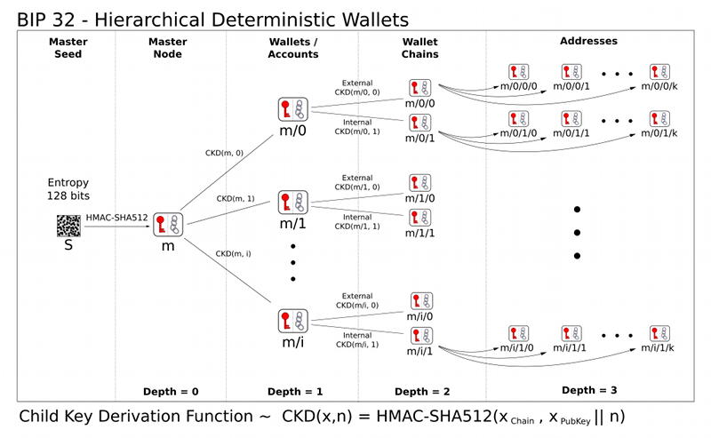

# Blockchain wallet utiles


## Development

```bash
export GOPROXY=https://goproxy.io,direct
go run *.go
```

## Build

```bash
go build -o ./bin/app *.go
```



* https://arshbot.medium.com/so-you-want-to-build-an-ethereum-hd-wallet-cb2b7d7e4998
* https://arshbot.medium.com/hd-wallets-explained-from-high-level-to-nuts-and-bolts-9a41545f5b0
* https://github.com/wenweih/ethereum-cold-wallet/blob/master/address.go
* https://idhww.medium.com/making-your-own-safety-cold-ethereum-hd-wallet-using-golang-b6f34b359c8f
* https://cointelegraph.com/ethereum-for-beginners/ethereum-wallets-a-beginners-guide-to-storing-eth
* https://www.gemini.com/cryptopedia/hd-crypto-wallets-hierachichal-deterministic
* https://medium.com/mycrypto/wtf-is-a-derivation-path-c3493ca2eb52